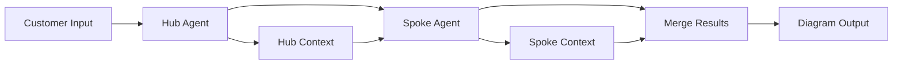

# LangGraph Agent Orchestration for Azure Landing Zone

## Overview

The Azure Landing Zone Agent now includes advanced LangGraph-based multi-agent orchestration to generate diagrams that clearly differentiate hub and spoke architecture principles. This implementation provides intelligent service categorization and sequential workflow execution for enhanced Azure architecture design.

## Architecture

### Multi-Agent Workflow

The LangGraph orchestration follows a three-stage workflow:

1. **Hub Agent** - Processes shared infrastructure services
2. **Spoke Agent** - Processes workload-specific services  
3. **Merge Results** - Combines outputs for final diagram generation



## Service Categorization

### Hub Services (Shared Infrastructure)
- **Network Security**: Azure Firewall, Network Security Groups, Bastion, VPN Gateway, ExpressRoute
- **Identity & Access**: Azure AD, Managed Identity, Key Vault
- **Monitoring**: Log Analytics, Azure Monitor, Security Center, Sentinel
- **Governance**: Azure Policy, Management Groups, Cost Management
- **DNS**: Private DNS, Azure DNS
- **Backup**: Recovery Services Vault, Site Recovery

### Spoke Services (Workload-Specific)
- **Compute**: Virtual Machines, App Services, AKS, Function Apps, Container Instances
- **Database**: SQL Database, Cosmos DB, MySQL, PostgreSQL, Redis Cache
- **Storage**: Storage Accounts, Blob Storage, Data Lake, File Shares
- **Analytics**: Databricks, Data Factory, Synapse Analytics
- **Integration**: API Management, Service Bus, Event Hubs, Logic Apps
- **AI/ML**: Cognitive Services, Machine Learning, Search Service

## Implementation Details

### Core Components

#### HubAgent Class
```python
class HubAgent:
    def analyze_hub_services(self, inputs: Dict[str, Any]) -> HubAgentResult:
        # Analyzes and categorizes hub services
        # Designs network topology
        # Defines security policies
        # Creates connectivity matrix
```

#### SpokeAgent Class
```python
class SpokeAgent:
    def analyze_spoke_services(self, inputs: Dict[str, Any], hub_context: Dict[str, Any]) -> SpokeAgentResult:
        # Processes workload-specific services
        # Designs spoke network topology
        # Defines data flow patterns
        # Creates scaling configurations
```

#### AzureLandingZoneOrchestrator
```python
class AzureLandingZoneOrchestrator:
    def process_landing_zone_request(self, customer_inputs: Dict[str, Any]) -> Dict[str, Any]:
        # Orchestrates multi-agent workflow
        # Manages state transitions
        # Returns comprehensive results
```

### Network Topology Design

The orchestration automatically designs network topology with proper CIDR allocation:

- **Hub VNet**: `10.0.0.0/16`
  - AzureFirewallSubnet: `10.0.1.0/26`
  - AzureBastionSubnet: `10.0.2.0/27`
  - GatewaySubnet: `10.0.3.0/27`
  - SharedServicesSubnet: `10.0.4.0/24`

- **Production Spoke**: `10.1.0.0/16`
  - WebTierSubnet: `10.1.1.0/24`
  - AppTierSubnet: `10.1.2.0/24`
  - DataTierSubnet: `10.1.3.0/24`

- **Development Spoke**: `10.2.0.0/16`
  - WebTierSubnet: `10.2.1.0/24`
  - AppTierSubnet: `10.2.2.0/24`
  - DataTierSubnet: `10.2.3.0/24`

## API Integration

### New Endpoint

#### POST /generate-hub-spoke-diagram

Generates Azure Landing Zone diagrams with LangGraph orchestration for clear hub-spoke separation.

**Request Body:**
```json
{
  "business_objective": "Enterprise web application with high availability",
  "network_services": ["firewall", "bastion", "vpn_gateway"],
  "compute_services": ["app_services", "virtual_machines"],
  "database_services": ["sql_database"],
  "storage_services": ["storage_accounts"],
  "security_services": ["security_center", "key_vault"],
  "scalability": "high",
  "security_posture": "zero_trust"
}
```

**Response:**
```json
{
  "success": true,
  "mermaid": "graph TB...",
  "drawio": "<?xml version='1.0'...",
  "tsd": "Technical Specification Document...",
  "hld": "High-Level Design Document...",
  "lld": "Low-Level Design Document...",
  "metadata": {
    "generated_at": "2024-01-01T12:00:00",
    "version": "1.0.0",
    "agent": "Azure Landing Zone Agent with LangGraph Orchestration",
    "orchestration_enabled": true,
    "hub_spoke_separation": true
  },
  "orchestration_details": {
    "hub_services_count": 9,
    "spoke_services_count": 8,
    "architecture_pattern": "hub_and_spoke",
    "execution_log": [
      "Workflow started",
      "Hub agent completed successfully",
      "Spoke agent completed successfully",
      "Results merged successfully"
    ]
  }
}
```

### Enhanced Diagram Generation

#### Mermaid Diagrams
- Clear visual separation between hub and spoke components
- Color-coded styling for different service types
- Proper connectivity representation
- Metadata annotations

#### Draw.io XML
- Structured layout with swimlanes for hub and spokes
- Official Azure icon integration
- Proper connection modeling
- Professional presentation

## Usage Examples

### Basic Enterprise Scenario
```python
from langgraph_workflow import create_orchestrator

orchestrator = create_orchestrator()

inputs = {
    "business_objective": "E-commerce platform",
    "network_services": ["firewall", "bastion"],
    "compute_services": ["app_services", "aks"],
    "database_services": ["sql_database", "cosmos_db"],
    "security_posture": "zero_trust"
}

result = orchestrator.process_landing_zone_request(inputs)
```

### Financial Services Compliance
```python
inputs = {
    "business_objective": "Banking application with PCI-DSS compliance",
    "regulatory": "PCI-DSS, SOX",
    "industry": "Financial Services",
    "network_services": ["azure_firewall", "bastion", "vpn_gateway"],
    "security_services": ["security_center", "sentinel", "key_vault"],
    "compute_services": ["app_services", "virtual_machines"],
    "database_services": ["sql_database"],
    "security_posture": "zero_trust",
    "backup": "comprehensive"
}
```

## Benefits

### 1. Intelligent Service Categorization
- Automatic classification of Azure services into hub vs spoke categories
- Reduces human error in architecture design
- Ensures proper separation of concerns

### 2. Sequential Agent Execution
- Hub agent establishes shared infrastructure foundation
- Spoke agent builds upon hub context for optimal design
- Results are merged for comprehensive output

### 3. Network Topology Optimization
- Automatic CIDR allocation and subnet design
- Proper security zone separation
- Optimized for Azure best practices

### 4. Enhanced Diagram Quality
- Clear visual differentiation between hub and spoke components
- Professional styling and layout
- Comprehensive connectivity representation

### 5. Extensibility
- Modular agent design allows for easy extension
- LangGraph provides robust state management
- Fallback mechanisms ensure reliability

## Dependencies

### Required Packages
```
langgraph>=0.0.40
langchain>=0.1.20
langchain-openai>=0.1.1
```

### Optional Packages
- OpenAI API for enhanced LLM integration
- Additional Azure service libraries

## Fallback Support

The implementation includes comprehensive fallback support:

- **Mock LangGraph**: Works without langgraph dependency
- **Traditional Generation**: Falls back to existing diagram methods
- **Error Handling**: Graceful degradation on failures

## Testing

### Unit Tests
```bash
python test_langgraph_integration.py
```

### Sample Demonstration
```bash
python sample_langgraph_demo.py
```

### API Testing
```bash
curl -X POST "http://localhost:8001/generate-hub-spoke-diagram" \
  -H "Content-Type: application/json" \
  -d '{"business_objective": "Test application", "compute_services": ["app_services"]}'
```

## Performance Considerations

- **Memory Usage**: Efficient state management with LangGraph
- **Execution Time**: Sequential processing with optimized algorithms
- **Scalability**: Modular design supports high-concurrency scenarios
- **Caching**: Results can be cached for repeated requests

## Security

- **Input Validation**: Comprehensive validation of customer inputs
- **State Isolation**: Each workflow execution is isolated
- **Secrets Management**: No sensitive data stored in workflow state
- **Audit Trail**: Complete execution logging for compliance

## Future Enhancements

1. **Additional Agent Types**: Database optimization agent, security compliance agent
2. **Advanced LLM Integration**: Enhanced decision making with larger language models
3. **Real-time Validation**: Live Azure resource validation during design
4. **Cost Optimization**: Automated cost analysis and optimization recommendations
5. **Multi-Region Support**: Geographic distribution and disaster recovery planning

## Troubleshooting

### Common Issues

1. **LangGraph Import Error**: Install with `pip install langgraph`
2. **Workflow Execution Failed**: Check input format and required fields
3. **Diagram Generation Error**: Verify service names and categories
4. **Network Issues**: Ensure proper CIDR allocation and subnet design

### Debug Mode
```python
import logging
logging.basicConfig(level=logging.DEBUG)

# Detailed execution logging will be displayed
result = orchestrator.process_landing_zone_request(inputs)
```

## Contributing

Contributions to enhance the LangGraph orchestration are welcome:

1. Fork the repository
2. Create a feature branch
3. Implement enhancements
4. Add comprehensive tests
5. Submit a pull request

## License

This implementation is part of the Azure Landing Zone Agent project and follows the same licensing terms.